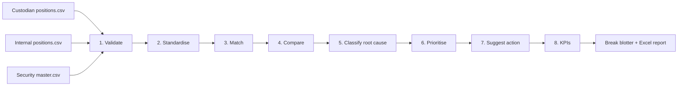
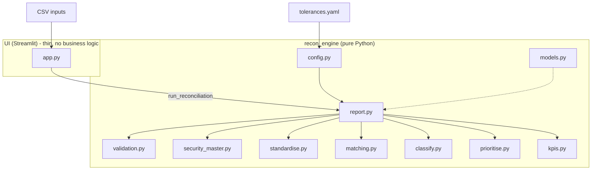
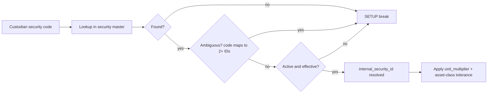
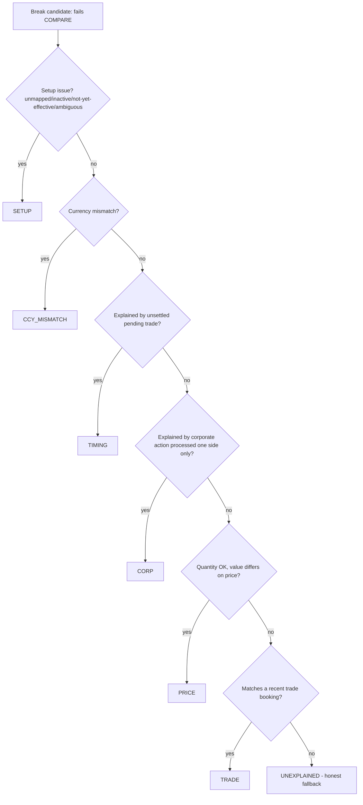

# Architecture & Process Diagrams

PNG renders of all four diagrams live in `docs/diagrams/`. Mermaid sources
(for quick viewing on GitHub / in any Mermaid-aware viewer) are below.

## 1. End-to-end process flow

## 2. Architecture

## 3. Security master mapping flow

## 4. Root-cause decision tree

